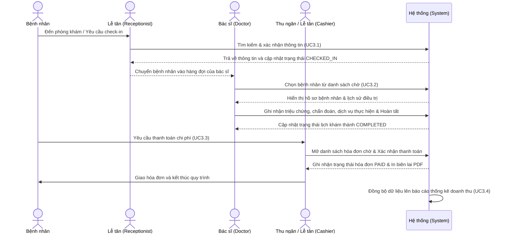
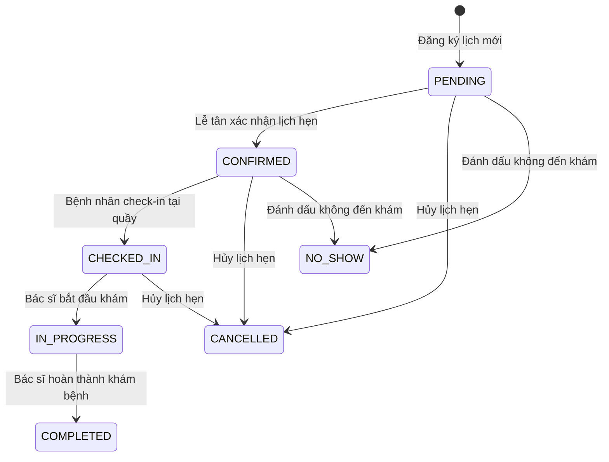
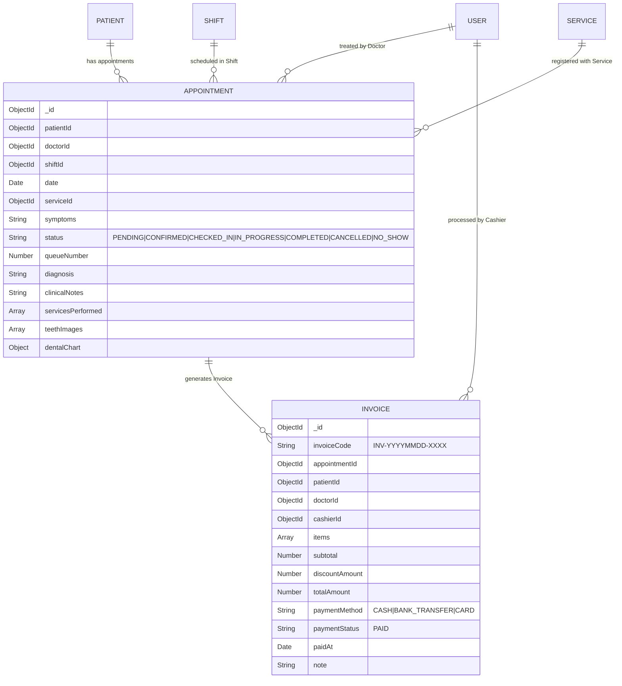

# BÁO CÁO CÀI ĐẶT VÀ LẬP TRÌNH NHÓM CHỨC NĂNG LÂM SÀNG & THANH TOÁN

## HỆ THỐNG QUẢN LÝ NHA KHOA MEC

**Nhóm chức năng bao gồm:**

* **UC2.5:** Theo dõi lịch khám (Appointment Monitor)
* **UC3.1:** Tiếp đón người đến khám (Check-in)
* **UC3.2:** Khám bệnh và cập nhật hồ sơ (Clinical Examination & Record Update)
* **UC3.3:** Thanh toán chi phí khám bệnh (Billing & Payment)
* **UC3.4:** Thống kê doanh thu (Revenue & Performance Statistics)

---

### 1. Môi trường cài đặt & Cấu hình

Hệ thống được phát triển theo mô hình ứng dụng web Client-Server hiện đại, tách biệt hoàn toàn giữa Frontend và Backend.

#### a. Frontend (Giao diện người dùng)

* **Công nghệ cốt lõi:** React JS (v19) chạy trên nền Vite.
* **Styling:** Tailwind CSS (v4) với thiết kế responsive, hỗ trợ hiển thị tốt trên máy tính và thiết bị máy tính bảng (tablet) phục vụ lễ tân.
* **Thư viện biểu đồ:** Recharts (dành cho thống kê doanh thu và hiệu suất bác sĩ).
* **Quản lý Router:** React Router DOM (v6).
* **Icons:** Google Material Symbols & Lucide React.

#### b. Backend (Máy chủ ứng dụng)

* **Runtime Environment:** Node.js (v18+).
* **Framework:** Express.js (kiến trúc RESTful API).
* **Cơ sở dữ liệu:** MongoDB với Mongoose ODM.
* **Bảo mật:** JSON Web Token (JWT) để xác thực người dùng và phân quyền dựa trên Role & Permission (RBAC).

#### c. Biến môi trường mẫu (`backend/.env`)

```env
PORT=5000
MONGODB_URI=mongodb+srv://<username>:<password>@<cluster>/mec_dental
JWT_SECRET=your_secret_key_here
JWT_EXPIRE=7d
NODE_ENV=development
```

---

### 2. Quy trình nghiệp vụ & Kiến trúc luồng (Workflow & Flowcharts)

#### a. Quy trình phối hợp lâm sàng và thanh toán (Clinical Workflow Sequence)

Quy trình hoạt động liên tục từ lúc bệnh nhân đến phòng khám cho đến khi thanh toán xong hóa đơn và cập nhật báo cáo tài chính:



#### b. Sơ đồ chuyển đổi trạng thái lịch khám (Appointment Status Transition)

Các trạng thái lịch khám tuân thủ nghiêm ngặt quy tắc nghiệp vụ phòng khám nhằm tránh sai sót dữ liệu:



---

### 3. Cấu trúc thư mục mã nguồn liên quan

Các file mã nguồn triển khai nhóm chức năng này được tổ chức như sau:

```text
Project/Mec/
├── backend/
│   └── src/
│       ├── controllers/
│       │   ├── appointmentController.js  # Xử lý UC2.5, UC3.1, UC3.2
│       │   ├── invoiceController.js      # Xử lý UC3.3 (Hóa đơn/Thanh toán)
│       │   └── reportController.js       # Xử lý UC3.4 (Thống kê doanh thu)
│       ├── models/
│       │   ├── Appointment.js            # Lược đồ lịch hẹn & bệnh án lâm sàng
│       │   ├── Invoice.js                # Lược đồ hóa đơn tài chính
│       │   └── Patient.js                # Lược đồ thông tin bệnh nhân
│       └── routes/
│           ├── appointmentRoutes.js      # Các tuyến đường API lịch hẹn
│           ├── invoiceRoutes.js          # Các tuyến đường API hóa đơn
│           └── reportRoutes.js           # Các tuyến đường API báo cáo thống kê
└── frontend/
    └── src/
        ├── pages/
        │   ├── admin/
        │   │   ├── AppointmentMonitor.jsx # Giao diện theo dõi, check-in, hủy lịch
        │   │   ├── PaymentManagement.jsx  # Giao diện lập hóa đơn & thanh toán
        │   │   └── reports/
        │   │       ├── DoctorPerformanceReport.jsx # Báo cáo hiệu suất bác sĩ
        │   │       ├── PatientServiceReport.jsx    # Báo cáo cơ cấu bệnh nhân & dịch vụ
        │   │       └── RevenueReport.jsx           # Báo cáo doanh thu trực quan
        │   └── doctor/
        │       ├── DoctorDashboard.jsx         # Dashboard của bác sĩ & hàng đợi khám
        │       └── DoctorAppointmentDetail.jsx # Màn hình khám bệnh & cập nhật hồ sơ
        └── services/
            ├── appointmentService.js      # Kết nối API lịch hẹn
            ├── invoiceService.js          # Kết nối API thanh toán hóa đơn
            └── reportService.js           # Kết nối API báo cáo thống kê
```

---

### 4. Thiết kế Cơ sở Dữ liệu & Lược đồ Thực thể (Database Schema)

Dưới đây là thiết kế chi tiết hai Collection cốt lõi kết nối chặt chẽ nhóm chức năng này: `appointments` và `invoices`.



#### Lược đồ Lịch khám bổ sung trường bệnh án lâm sàng (`Appointment.js`)

```javascript
const appointmentSchema = new mongoose.Schema({
  patientId: { type: mongoose.Schema.Types.ObjectId, ref: 'Patient', required: true },
  doctorId: { type: mongoose.Schema.Types.ObjectId, ref: 'User', required: true },
  shiftId: { type: mongoose.Schema.Types.ObjectId, ref: 'Shift', required: true },
  date: { type: Date, required: true },
  serviceId: { type: mongoose.Schema.Types.ObjectId, ref: 'Service', required: true },
  symptoms: { type: String },
  status: { 
    type: String, 
    enum: ['PENDING', 'CONFIRMED', 'CHECKED_IN', 'IN_PROGRESS', 'COMPLETED', 'CANCELLED', 'NO_SHOW'], 
    default: 'PENDING' 
  },
  queueNumber: { type: Number },
  
  // Thông tin lâm sàng cập nhật khi khám bệnh (UC3.2)
  diagnosis: { type: String }, // Chẩn đoán bệnh (Bắt buộc khi hoàn tất)
  clinicalNotes: { type: String }, // Ghi chú lâm sàng
  servicesPerformed: [{ // Các dịch vụ thực tế đã thực hiện trong phòng khám
    serviceId: { type: mongoose.Schema.Types.ObjectId, ref: 'Service' },
    quantity: { type: Number, default: 1 },
    priceAtAppointment: { type: Number } // Lưu giá tại thời điểm thực hiện
  }],
  prescription: { type: String }, // Đơn thuốc điều trị
  teethImages: [{ type: String }], // Mảng đường dẫn ảnh chụp X-ray/Răng miệng
  dentalChart: { type: Map, of: String } // Bản đồ ghi nhận tình trạng răng (vd: {"18": "Sâu răng"})
}, { timestamps: true });
```

---

### 5. Chi tiết Lập trình Backend (Backend Implementation)

#### a. API Lịch khám & Check-in (`appointmentController.js`)

* **API Theo dõi lịch khám (UC2.5)**
  * *Endpoint:* `GET /api/v1/appointments/monitor`
  * *Logic xử lý:* Bộ lọc dữ liệu linh hoạt (theo ngày, bác sĩ, ca trực và trạng thái). Kết quả trả về được sắp xếp theo số thứ tự khám (`queueNumber`) để dễ dàng điều phối hàng đợi.
* **API Check-in bệnh nhân (UC3.1)**
  * *Endpoint:* `PATCH /api/v1/appointments/:id/status`
  * *Body:* `{"status": "CHECKED_IN"}`
  * *Quy tắc nghiệp vụ:* Chỉ cho phép chuyển trạng thái sang `CHECKED_IN` đối với lịch hẹn đang ở trạng thái `CONFIRMED`.
* **API Cập nhật hồ sơ khám bệnh (UC3.2)**
  * *Endpoint:* `PUT /api/v1/appointments/:id/examine`
  * *Body:* Nhận toàn bộ kết quả chẩn đoán, dịch vụ phát sinh, đơn thuốc và biểu đồ răng.
  * *Logic xử lý:* Chuyển trạng thái lịch khám sang `COMPLETED`, lưu trữ lịch sử điều trị của bệnh nhân và mở khóa để sẵn sàng làm thủ tục thanh toán.

#### b. API Hóa đơn & Thanh toán (`invoiceController.js`) (UC3.3)

* **Lấy danh sách chờ thanh toán**
  * *Endpoint:* `GET /api/v1/invoices/pending?date=YYYY-MM-DD`
  * *Logic xử lý:* Tìm toàn bộ các cuộc hẹn có trạng thái `COMPLETED` của ngày được chọn và *chưa tồn tại* hóa đơn thanh toán tương ứng. Trả về thông tin đi kèm bản xem trước hóa đơn (`billingItems` và `billingTotal`).
* **Tạo hóa đơn & Thanh toán**
  * *Endpoint:* `POST /api/v1/invoices/from-appointment/:appointmentId`
  * *Body:* `{"paymentMethod": "CASH|BANK_TRANSFER|CARD", "note": "Ghi chú thanh toán"}`
  * *Quy tắc nghiệp vụ:* Tạo hóa đơn có mã hóa duy nhất `INV-YYYYMMDD-XXXX` (trong đó YYYYMMDD là ngày hiện tại, XXXX là số thứ tự tăng dần trong ngày). Tính tổng tiền thực tế dựa trên danh sách dịch vụ bác sĩ đã thực hiện. Đánh dấu hóa đơn đã thanh toán (`PAID`).

#### c. API Thống kê & Báo cáo (`reportController.js`) (UC3.4)

* **Báo cáo hiệu suất bác sĩ:**
  * *Endpoint:* `GET /api/v1/reports/doctor-performance?dateFrom=...&dateTo=...`
  * *Logic xử lý:* Sử dụng MongoDB Aggregation Pipeline để đếm tổng số ca khám (thành công, hủy, vắng mặt) của từng bác sĩ, kết hợp dữ liệu bảng hóa đơn để tính toán tổng doanh thu mang lại và doanh thu trung bình trên mỗi ca khám.
* **Báo cáo dịch vụ và cơ cấu bệnh nhân:**
  * *Endpoint:* `GET /api/v1/reports/patients-services?dateFrom=...&dateTo=...`
  * *Logic xử lý:* Phân tích cơ cấu độ tuổi bệnh nhân, cơ cấu giới tính dựa trên ngày sinh và giới tính trong cơ sở dữ liệu. Thống kê dịch vụ nha khoa được sử dụng nhiều nhất dựa trên số lượng bán ra và doanh thu thực tế.

---

### 6. Chi tiết Lập trình Frontend (Frontend Implementation)

#### a. Giao diện Theo dõi & Check-in (`AppointmentMonitor.jsx`)

* Hiển thị danh sách lịch hẹn dưới dạng bảng trực quan (hỗ trợ chuyển đổi nhanh sang màn hình Calendar).
* Thanh bộ lọc thời gian thực: cho phép lọc nhanh theo bác sĩ phụ trách, ca làm việc và thanh tìm kiếm nhanh (bệnh nhân/mã lịch).
* Cung cấp các nút thao tác nhanh (Check-in, Không đến, Hủy lịch) với cơ chế xác nhận và cập nhật UI không cần tải lại trang.

#### b. Giao diện Bác sĩ Khám bệnh (`DoctorDashboard.jsx` & `DoctorAppointmentDetail.jsx`)

* **DoctorDashboard.jsx:** Hiển thị hàng đợi các bệnh nhân có trạng thái `CHECKED_IN` thuộc ca trực của bác sĩ đang đăng nhập.
* **DoctorAppointmentDetail.jsx:** Giao diện nhập thông tin chi tiết:
  * Form nhập triệu chứng lâm sàng, chẩn đoán (Bắt buộc điền mới được phép hoàn tất).
  * Bảng chọn dịch vụ điều trị: Hỗ trợ thêm nhiều dịch vụ và cập nhật số lượng trực tiếp.
  * Sơ đồ răng tương tác: Cho phép click chọn từng răng cụ thể và gán tình trạng bệnh lý tương ứng.
  * Khu vực đính kèm/upload hình ảnh X-ray/chẩn đoán hình ảnh.

#### c. Giao diện Thanh toán hóa đơn (`PaymentManagement.jsx`)

* Hiển thị danh sách bệnh nhân đã hoàn thành khám chờ thanh toán trong ngày.
* Khi chọn một bệnh nhân, hiển thị popover/modal xem trước chi tiết hóa đơn (dịch vụ khám, dịch vụ điều trị đi kèm, tổng tiền).
* Form lựa chọn phương thức thanh toán linh hoạt: Tiền mặt (`CASH`), Chuyển khoản (`BANK_TRANSFER`), hoặc Quẹt thẻ (`CARD`).
* Hỗ trợ in hóa đơn xuất file PDF trực quan, chuyên nghiệp.

#### d. Giao diện Thống kê Báo cáo (`reports/`)

* Tích hợp biểu đồ cột (`BarChart`), biểu đồ tròn (`PieChart`) của thư viện Recharts nhằm trực quan hóa doanh thu theo thời gian, tỷ trọng doanh thu giữa các bác sĩ, và phân bổ cơ cấu dịch vụ phòng khám.
* Cho phép xuất nhanh dữ liệu thống kê ra file định dạng Excel hoặc PDF phục vụ báo cáo.

---

### 7. Quy tắc lập trình & Chuẩn dữ liệu (Development Guidelines)

1. **Đồng bộ múi giờ:** Toàn bộ ngày tháng lưu trữ trên MongoDB là giờ UTC chuẩn. Khi trao đổi API và hiển thị tại Frontend, bắt buộc phải đồng bộ hóa và hiển thị theo múi giờ Việt Nam (`Asia/Ho_Chi_Minh` - GMT+7).
2. **Ràng buộc logic nghiệp vụ bắt buộc:**
    * Bác sĩ không thể bắt đầu khám (`examine`) cho lịch hẹn chưa có trạng thái `CHECKED_IN`.
    * Một lịch khám chỉ được phép check-in một lần duy nhất.
    * Hóa đơn khi đã chuyển sang trạng thái thanh toán thành công (`PAID`) sẽ bị khóa, tuyệt đối không cho phép chỉnh sửa thông tin dịch vụ hoặc số tiền nhằm bảo mật tài chính.
3. **Xử lý lỗi tập trung:** API Backend không được trả trực tiếp status 500 kèm stack trace. Toàn bộ lỗi được chuyển qua middleware xử lý lỗi tập trung (`errorHandler.js`) để trả về thông điệp lỗi thân thiện với người dùng dạng JSON:

    ```json
    {
      "success": false,
      "message": "Thông điệp lỗi chi tiết bằng tiếng Việt"
    }
    ```

4. **Tối ưu hóa tìm kiếm:** Tên bệnh nhân và mã bệnh nhân được đánh chỉ mục (Index) trên MongoDB giúp lễ tân tìm kiếm nhanh dưới 2 giây phục vụ tiếp đón tại quầy.

---
**Người thực hiện lập báo cáo:** Lê Phạm Thành Đạt
